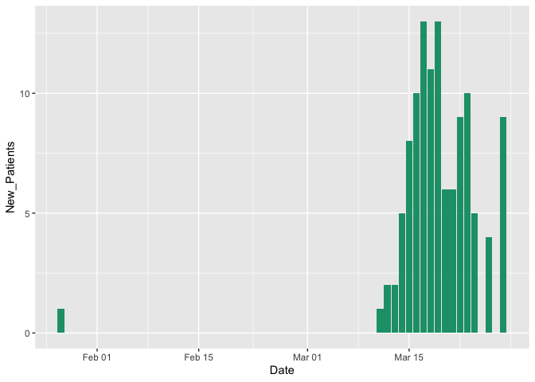
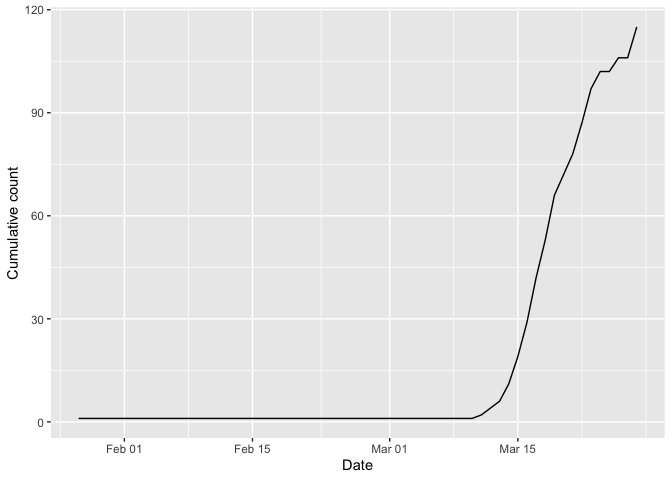

slcorona
========

Daily summary of the confirmed Coronavirus (COVID-19) cases in Sri Lanka

Installation
------------

You could install the development version from Github using

    # install.packages("devtools")
    # devtools::install_github("thiyangt/slcorona")
    library(slcorona)

Example
-------

    library(slcorona)
    ## basic example code
    data(newpatients)
    head(newpatients)

    ##         Date New_Patients
    ## 1 2020-01-27            1
    ## 2 2020-01-28            0
    ## 3 2020-01-29            0
    ## 4 2020-01-30            0
    ## 5 2020-01-31            0
    ## 6 2020-02-01            0

Visualization
-------------

    library(ggplot2)
    ggplot(newpatients, aes(y=New_Patients, x=Date)) + geom_bar(stat="identity", fill="#1b9e77")

    library(ggplot2)
    ggplot(newpatients, aes(y=cumsum(New_Patients), x=Date)) + geom_line() + ylab("Cumulative count")

